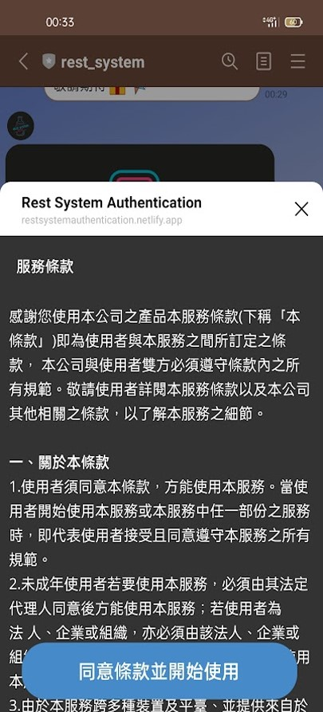
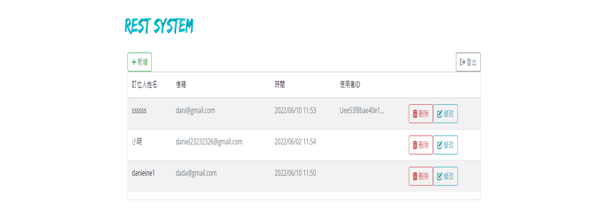
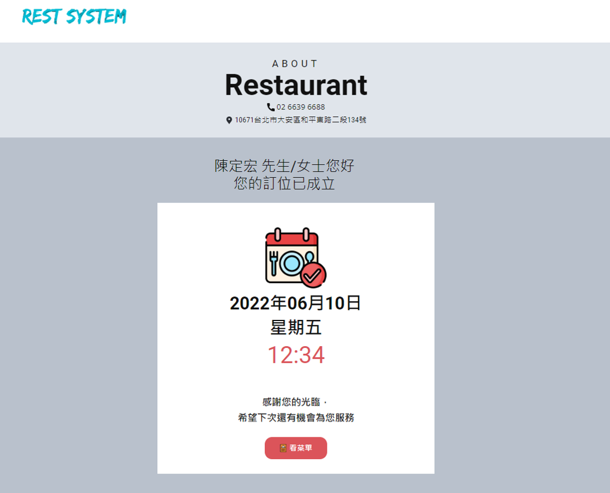
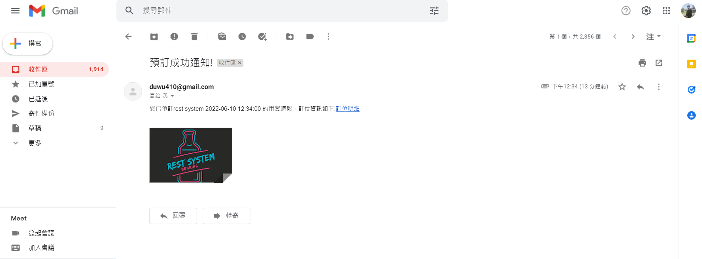
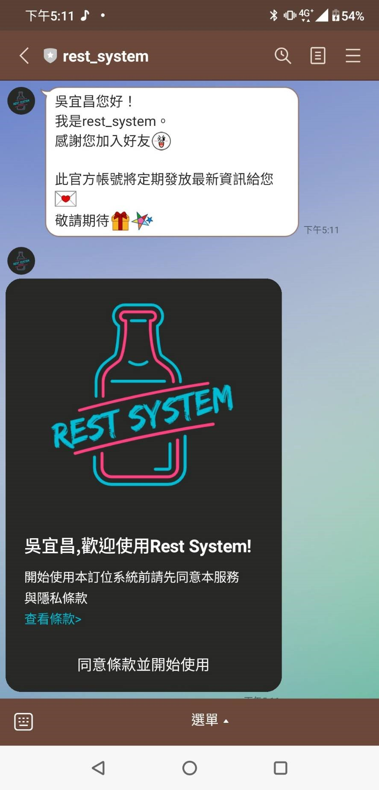
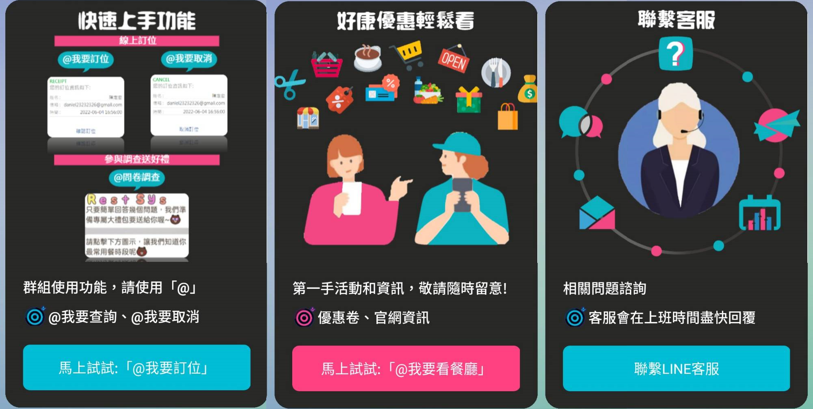
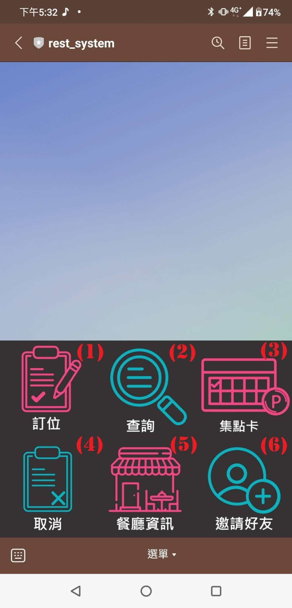
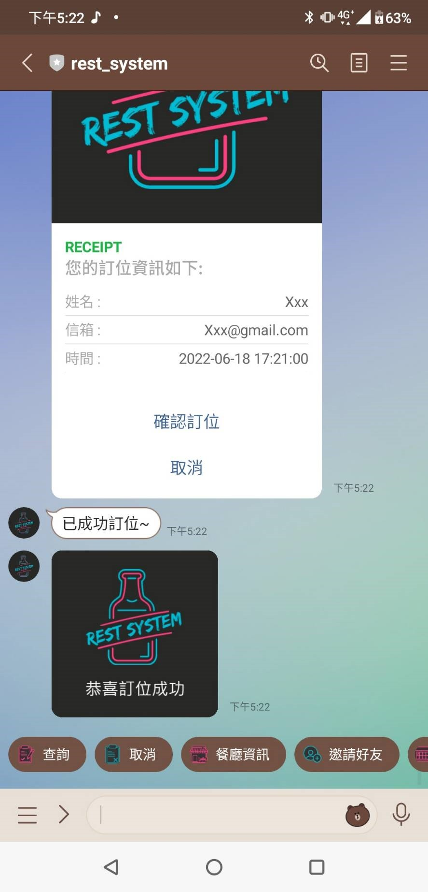
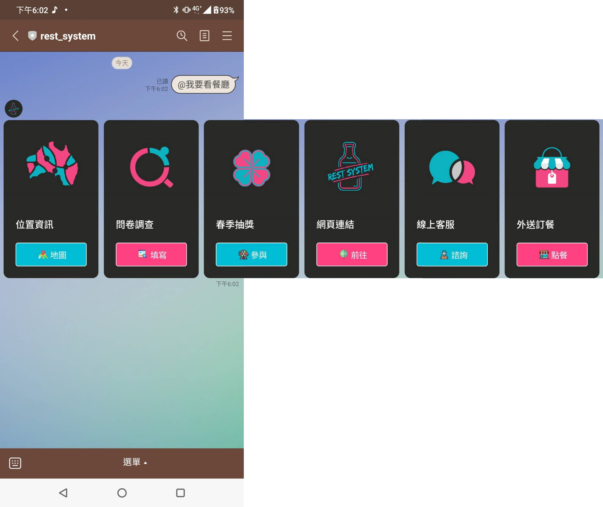

# 20220323_Rest_system_line_bot
使用linebot實作之餐廳管理系統  
  
linebot端: 訂位,查詢,取消,集點卡,餐廳資訊,問卷調查,抽獎  
  
web端: 餐廳主頁資訊,訂位確認頁面,404頁面,後臺頁面  
  
NotionAPI: 後台訂位資訊,訂位行事曆  

Email: 通知用戶訂位資訊,並超連結導入網頁"訂位確認頁面"  
  
Azure LUIS: 智能判斷用戶問題類別
  
工具      | 功能
----------|-------
Line API  | RichMenu,Sticker,Emoji,AllMessageType,QuickReply 
Notion API| Create,Delete,Update
Email     | Send reserve information
LUIS      | Return similiar response to user
Schedule  | Push coupon to user in birth month
Liff      | Terms of Service
netlify   | static page
  
  
liff tool : https://developers.line.biz/en/docs/liff/trying-liff-app/#how-to-start-liff-starter-app  

將LINE Bot部署到Heroku雲端平台時，在HTTP請求(Request)的處理上，就需要使用WSGI(Web Server Gateway Interface)介面，來負責網頁伺服器(Heroku雲端平台)與網頁應用程式(LINE Bot)之間的溝通，而Python的gunicorn伺服器就是扮演這樣的角色  
 
  
  
  
  
  
  
  
  
    
  
  
